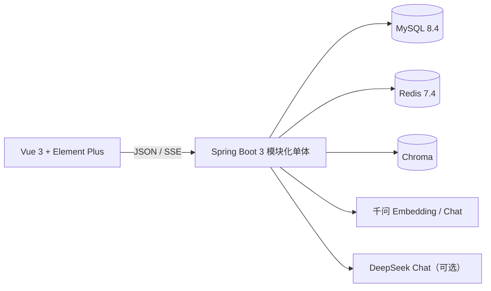

# BrainOS

BrainOS 是一个面向答辩演示的 AI 企业知识库。它支持真实文档导入、千问 Embedding、Chroma 向量检索、千问/DeepSeek 问答、来源引用、用户管理和安全审计。项目只实现 PC Web，功能比基础示例更完整，同时保持单体架构易于讲解。

## 核心功能

- JWT 登录、Redis 刷新令牌、`ADMIN/USER` 权限。
- 知识库 CRUD，PDF/DOCX/TXT/Markdown 导入（单文件不超过 20MB）。
- Apache Tika 解析、切片、千问 `text-embedding-v4` 向量化和 Chroma 持久化。
- 限定知识库的 Top 5 RAG 检索，低可信时明确说明无可靠依据。
- 千问默认问答、DeepSeek 可选，SSE 流式输出、停止/重试和文档引用。
- 4 项真实工作台指标、7 天 ECharts 趋势和最近文档。
- 管理员用户管理、最后一名管理员保护、关键操作审计与筛选。

## 技术架构



| 层次 | 主要技术 |
| --- | --- |
| 前端 | Vue 3、TypeScript、Vite、Pinia、Vue Router、Element Plus、ECharts |
| 后端 | Java 21、Spring Boot 3.5、Spring Security、Spring AI、MyBatis-Plus |
| 数据 | MySQL、Redis、Chroma、Flyway、本地文件存储 |
| 模型 | 千问 Embedding/Chat，DeepSeek Chat |
| 质量 | JUnit 5、Testcontainers、Vitest、Playwright、Swagger UI |

## 快速启动

### 1. 环境要求

- JDK 21
- Docker Desktop 与 Docker Compose
- Node.js 20+
- pnpm 11（项目锁定 `pnpm@11.7.0`）

### 2. 配置环境变量

```bash
cp .env.example .env
```

至少填写：

```dotenv
QWEN_API_KEY=你的阿里云百炼_API_Key
# 只有选择 DeepSeek 会话时才需要
DEEPSEEK_API_KEY=你的_DeepSeek_API_Key
```

不要将真实密钥提交到 Git。千问 Key 用于文档 Embedding 和默认问答；没有 Key 时仍可启动并演示管理功能，但无法完成真实索引与问答。

使用 Chroma Cloud 时，再从 Cloud 数据库的连接页填入：

```dotenv
CHROMA_URL=https://api.trychroma.com
CHROMA_API_KEY=你的_Chroma_Cloud_API_Key
CHROMA_TENANT=你的_Tenant_ID
CHROMA_DATABASE=你的_Database_Name
```

留空 `CHROMA_API_KEY` 并保持 `.env.example` 中的默认值，则继续使用本地 Chroma。本地与 Cloud 是两个独立索引，切换后必须重新上传或重建文档索引。

### 3. 启动基础设施

```bash
docker compose up -d --wait mysql redis
# 仅使用本地 Chroma 时再启动：docker compose up -d --wait chroma
docker compose ps
```

### 4. 启动后端

```bash
cd backend
set -a
source ../.env
set +a
./mvnw spring-boot:run
```

后端默认为 `http://localhost:8080`。首次启动由 Flyway 建表并创建开发管理员：

- 用户名：`admin`
- 密码：`BrainOS@123`

该密码仅适用于 `dev` 演示。非开发环境必须设置 `BRAINOS_ADMIN_PASSWORD`。

### 5. 启动前端

```bash
cd frontend
pnpm install --frozen-lockfile
pnpm dev
```

打开 `http://localhost:5173`。Vite 会将 `/api` 代理到后端。

## 文档导入演示

1. 登录后进入“知识库”，创建“员工制度”。
2. 进入该知识库，上传 [fixtures/employee-handbook.md](fixtures/employee-handbook.md)。
3. 状态会从“解析中”、“索引中”变为“可用”。
4. 进入“AI 问答”，选择该知识库，询问：`正式员工每年有几天年假，如何申请？`
5. 答案应包含“5 天”、申请流程和可展开的来源引用。

更完整的答辩流程见 [docs/DEFENSE-DEMO.md](docs/DEFENSE-DEMO.md)。

## API 文档

后端启动后：

- Swagger UI：`http://localhost:8080/swagger-ui/index.html`
- OpenAPI JSON：`http://localhost:8080/v3/api-docs`
- 健康检查：`http://localhost:8080/actuator/health`

在 Swagger UI 点击 **Authorize**，填入登录获得的 JWT 即可调用受保护接口。

## 验证

```bash
# 完整验证（会启动 Docker 依赖）
bash scripts/verify.sh

# 分层验证
cd backend && ./mvnw verify
cd frontend && pnpm test && pnpm typecheck && pnpm build
cd frontend && pnpm exec playwright test
```

当前验证结果和验收映射见 [docs/TEST-REPORT.md](docs/TEST-REPORT.md)。

## 常见问题

- 文档长时间停在“解析中/索引中”：检查 `QWEN_API_KEY`、Chroma 健康状态和后端日志。
- 文档直接失败：检查格式、20MB 限制、内容是否为空，以及是否重复上传。
- AI 回答“未找到可靠依据”：确认文档状态为“可用”，并选择了正确知识库。
- DeepSeek 无法回答：检查 `DEEPSEEK_API_KEY`，或切回默认千问。
- 3306/6379/8000 端口占用：停止本机同类服务，或同步修改 Compose 映射和对应环境变量。

## 其他文档

- [部署说明](docs/DEPLOYMENT.md)
- [答辩演示脚本](docs/DEFENSE-DEMO.md)
- [测试与验收报告](docs/TEST-REPORT.md)
- [Spec 导航](specs/index.md)
