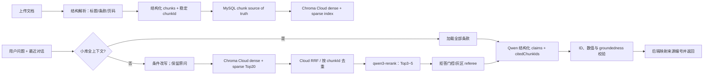

# 企业 AI 知识库 / RAG 行业实践与 BrainOS 落地取舍

> 调研日期：2026-07-15
> 范围：只引用官方产品文档、官方源码/项目文档和原始论文。本文不是对某个阈值的继续微调，而是为 BrainOS 的检索链路重构提供依据。

## 结论先行

BrainOS 当前效果不稳定的主因不是 `qwen-turbo` 不会回答，而是“单路稠密向量召回 → 固定 cosine 阈值 → 直接生成”承担了过多职责。截图中的错误正是典型失败：正确条款没有进入上下文，模型只能忠实地基于错误切片回答“未提及”。继续下调阈值会增加召回，但也会把更多无关切片送给模型；继续增加提示词则无法补回根本没有召回的内容。

企业知识库的常见主链路是：**结构化切片 →（按需）查询改写 → 关键词与向量并行召回 → 排名融合 → rerank → 置信度/可回答性门控 → 基于证据生成 → 引用与 groundedness 校验**。阿里云百炼的官方知识问答产品直接暴露了查询改写、向量 TopK、关键词 TopK、reranker、rerank 阈值、最大返回数、拒答和引用等独立配置；这说明这些能力是不同阶段，而不是一个相似度阈值的不同写法。[阿里云 Knowledge Q&A 官方文档](https://help.aliyun.com/en/model-studio/rag-knowledge-qa)

同时，当前演示知识库只有一份很短的员工手册。Anthropic 官方建议，当整个知识库小于约 200,000 tokens 时，可以直接把完整知识库放进上下文而不必使用 RAG。[Anthropic Contextual Retrieval](https://www.anthropic.com/engineering/contextual-retrieval) BrainOS 应采用更保守的“小库全上下文”快速路径（例如不超过 20 个条款且总计不超过 12,000 tokens），从根本上避免一份短手册因 TopK 排名而漏掉正确条款；知识库增大后再进入标准混合检索链路。这个阈值是项目工程取舍，需用本项目模型和延迟实测，不是行业固定值。

## 1. 文档结构感知与语义切片

### 行业做法

固定长度只是防止上下文溢出的下限方案，制度、手册、合同和产品文档通常先按标题、章节、段落、列表或表格边界切分，再只对过长的逻辑单元做 token 级二次切分。Spring AI 的 `MarkdownDocumentReader` 会把标题保存为 metadata、把段落作为内容，并可单独处理代码块、引用和水平分隔线；`TokenTextSplitter` 则负责在 token 上限内尽量在标点处断开，并保留原文 metadata。[Spring AI 1.1 ETL 官方文档](https://docs.spring.io/spring-ai/reference/1.1/api/etl-pipeline.html)

阿里云的 RAG 优化文档指出，过短切片缺少语境、过长切片混入无关主题、强制断点可能丢失语义；其智能切片先按句段划分，再根据语义相关性自适应选择切点，并明确要求上线前检查实际切片。[阿里云 RAG performance optimization](https://help.aliyun.com/en/model-studio/rag-optimization) Anthropic 进一步提出给每个 chunk 增加来自全文的简短上下文，以减少“这家公司”“上一季度”等失去指代对象的问题，但这需要离线 LLM 调用和额外索引成本。[Anthropic Contextual Retrieval](https://www.anthropic.com/engineering/contextual-retrieval)

### BrainOS 取舍

当前 `DocumentChunker` 已有“Markdown 标题优先、过长后再 token 切分”的正确方向，但结构识别依赖解析后的文本仍保留行首 Markdown 标题；DOCX、PDF 或被 Tika 展平的内容会退化为长度切片。现有 chunk metadata 也缺少标题路径和字符范围，UI 只能显示整个切片，难以精确核对。

本项目采纳：

- 按 MIME 类型解析；Markdown 保留标题树，PDF/DOCX 尽可能保留段落和页码。
- 以“一个制度条款/一个标题段”为首选 chunk；只在单条款过长时使用 `TokenTextSplitter`。
- 给每个 chunk 保存稳定的 `chunkId`、`documentId`、`headingPath`、`sectionId`、`pageNumber`、`startOffset`、`endOffset`、`documentVersion`。
- 将 `标题路径 + 正文` 一起用于 embedding 和关键词索引，展示引用时仍显示原始正文。
- overlap 只允许发生在同一条款内部，不能把上一制度条款尾部拼到下一条款。
- 上传或重新索引后提供切片预览；本次手册必须重新索引，避免旧的大切片继续留在 Chroma。

暂不采纳“为每个 chunk 调用 LLM 生成上下文”的 Contextual Retrieval。它有官方实验依据，但对一份短手册收益有限，且增加上传耗时、成本和不可重复性；先把标题、条款和 metadata 做正确。

## 2. 稀疏 + 稠密混合检索

### 行业做法

稠密 embedding 擅长同义表达和语义近邻，BM25/关键词检索擅长工号、产品型号、错误码、日期以及原文中的精确词。Anthropic 给出的标准 RAG 流程就是分别运行 BM25 与 embedding 检索，再做去重和 rank fusion；其官方实验中，组合方案优于单独 embedding。[Anthropic Contextual Retrieval](https://www.anthropic.com/engineering/contextual-retrieval) Elastic 官方也推荐用 RRF 合并全文检索和向量检索，因为 RRF 使用排名而非不可直接比较的原始分数。[Elastic Hybrid Search 官方文档](https://www.elastic.co/docs/solutions/search/hybrid-search) [Elastic RRF 官方参考](https://www.elastic.co/docs/reference/elasticsearch/rest-apis/reciprocal-rank-fusion)

RRF 的简化形式为：

```text
RRF(d) = Σ 1 / (k + rank_i(d))
```

它避免直接相加 BM25 分数和 cosine 分数。对于中文制度问答，关键词通道可召回“下班时间”对应含“工作时间/18:00”的条款，而向量通道负责“几点走”“可疑邮件怎么办”等改写表达。

### Chroma 的现实约束与 Cloud 决策

BrainOS 原本使用本地 Chroma 和 Spring AI 1.1.8 的 legacy `queryCollection`，当前路径是稠密向量 KNN。Chroma 的 `where_document` 只提供大小写敏感的 `$contains`、`$not_contains` 和 regex 过滤，不是 BM25 排名，不能把它包装成“混合检索”。[Chroma Full Text Search 官方文档](https://docs.trychroma.com/docs/querying-collections/full-text-search) Chroma 新 Search API 支持 sparse vector 与 RRF，且官方目前明确标注为 Chroma Cloud only。[Chroma Search API Overview](https://docs.trychroma.com/cloud/search-api/overview) [Chroma Hybrid Search with RRF](https://docs.trychroma.com/cloud/search-api/hybrid-search)

2026-07-15 项目决策更新：用户已获得足够的 Chroma Cloud 免费额度，因此存储层迁移到 Cloud。第一步保持现有 Spring AI dense API，先完成鉴权、Tenant/Database 路由和文档重建索引；第二步再以 Cloud Search API 实现 sparse+dense+RRF，避免在一次改造中同时改连接层和检索算法。

### BrainOS 取舍

迁移到 Chroma Cloud 后，不再优先引入本地 Lucene。第二阶段优先使用 Chroma Cloud 原生 sparse+dense+RRF Search API，以减少双索引一致性和答辩讲解成本。

建议初始参数（只是评测起点）：原问题和改写问题分别走 Chroma Cloud dense 与 sparse 候选，在 Cloud 侧用 RRF 合并为最多 30 个候选。不要线性相加两种原始 score，也不要再用“四个连续字符相同”充当低分候选的通用放行规则。

为了保证索引可恢复，MySQL 中可新增 chunk source-of-truth 表；文档上传/删除先提交 chunk 记录，再幂等更新 Chroma Cloud，并提供“按 documentId 重建索引”。答辩项目不需要引入分布式事务，状态机与可重建索引已经足够。

## 3. Reranking 与两阶段检索

第一阶段检索的目标是高 recall，允许混入噪声；第二阶段 reranker 同时读取 query 和候选正文，用更昂贵的交叉注意力判断“这段是否真正回答问题”。Elastic 官方把 reranking 定义为对第一阶段小候选集进行更昂贵的重排，而不是让 reranker 扫描全库。[Elastic Ranking and reranking](https://www.elastic.co/docs/solutions/search/ranking)

阿里云官方建议 embedding 初召后使用 rerank；`qwen3-rerank` 面向文本搜索和 RAG，支持 100+ 语言、单次最多 500 个文档、单文档最多 4,000 tokens，并允许用 instruction 指定“问答相关性”而非泛化语义相似度。[阿里云 Reranking API](https://help.aliyun.com/en/model-studio/rerank) [阿里云 Embedding and rerank 模型说明](https://help.aliyun.com/en/model-studio/embedding-rerank-model/)

BrainOS 采纳：RRF 后取 20–30 个候选调用 `qwen3-rerank`，instruction 使用问答检索模式，最终保留 3–5 个不同条款。reranker 单独封装为 `RerankPort`，通过 HTTP adapter 调用百炼，不必为了它升级整套 Spring AI。现有 `qwen-turbo` 可继续承担简单事实生成；阿里云官方也将 Turbo/Flash 定位为简单查询和总结，而复杂多段推理才需要 Plus/Max。[阿里云 RAG performance optimization](https://help.aliyun.com/en/model-studio/rag-optimization) 因此仅更换生成模型不是本轮优先项。

## 4. Query rewriting

Query rewriting 的作用是把“下班时间？”、“那年假呢？”等短问、指代和多轮省略改成可独立检索的问题，而不是生成答案。原始 `Rewrite-Retrieve-Read` 论文指出，用户输入与检索所需查询之间存在差距，在检索前加入改写可以改善知识密集任务。[原始论文：Query Rewriting for Retrieval-Augmented Large Language Models](https://aclanthology.org/2023.emnlp-main.322/)

Spring AI 1.1 已提供 `CompressionQueryTransformer`（结合历史压缩成独立问题）、`RewriteQueryTransformer`（处理冗长、含糊或无关信息）和 `MultiQueryExpander`。[Spring AI 1.1 RAG 官方文档](https://docs.spring.io/spring-ai/reference/1.1/api/retrieval-augmented-generation.html) 阿里云企业知识问答也把 query rewriting 作为可开关能力，而非所有请求强制执行。[阿里云 Knowledge Q&A](https://help.aliyun.com/en/model-studio/rag-knowledge-qa)

BrainOS 采纳“条件改写”：仅在问题过短、包含指代词、存在对话历史省略或第一次检索置信度低时，用低温度 Qwen 生成一个 standalone query。**原问题必须保留并与改写问题并行召回**，防止改写删除型号、时间、制度名等精确词。日志记录 `rawQuery`、`rewrittenQuery` 和各通道命中，便于答辩展示和回归分析。

暂不采用 HyDE、一次生成 3–5 个 MultiQuery、Agentic 多轮检索。HyDE 原始论文也承认生成的假设文档可能包含幻觉；这些技术适合复杂开放域检索，却会放大当前小知识库的成本和调试空间。[HyDE 原始论文](https://aclanthology.org/2023.acl-long.99/)

## 5. 置信度门控与无答案策略

向量相似度不是“答案正确概率”。阿里云官方特别说明绝对相似度仅供参考，并明确表示没有通用最佳阈值，阈值应通过命中测试和业务评测集确定；其知识库拒答流程是先用阈值过滤，再由 referee model 深度判断问题与文档是否相关。[阿里云 RAG performance optimization](https://help.aliyun.com/en/model-studio/rag-optimization) Spring AI 的 `RetrievalAugmentationAdvisor` 默认在空上下文时要求模型不回答，也支持显式配置空上下文行为。[Spring AI 1.1 RAG 官方文档](https://docs.spring.io/spring-ai/reference/1.1/api/retrieval-augmented-generation.html)

BrainOS 不再用“dense top1 ≥ 0.45 就信任整个候选集合”。推荐采用三段门控：

1. Rerank 后无候选，或最高分低于评测得到的 `T_reject`：直接返回固定的“当前知识库中未找到可靠依据”。
2. 最高分高于 `T_accept` 且 top chunk 能直接回答：进入生成。
3. 介于两者之间的灰区：调用一个轻量 answerability/referee prompt，只输出 `ANSWERABLE/NOT_ANSWERABLE` 与支持的 `chunkIds`；不让 referee 自己回答业务问题。

`T_reject`、`T_accept` 和 TopK 都必须从测试集校准，不在代码中宣称某个数字是行业标准。库外问题、敏感问题和闲聊应作为负例计算拒答 precision/recall，而不是只测试“能答出来”的正例。

小库全上下文路径没有检索分数，生成模型必须先输出结构化 `answerable`，后端再执行下面的引用/groundedness 校验；校验失败同样拒答。

## 6. 引用与 groundedness 校验

仅在 prompt 中要求模型写 `[来源1]` 不能保证编号与事实一致。ALCE 原始论文把引用质量拆成 citation correctness 与 citation completeness，并发现即使强模型也经常缺少完整支持，说明“有引用样式”不等于“引用可靠”。[ALCE 原始论文](https://aclanthology.org/2023.emnlp-main.398/)

成熟产品把引用作为结构化数据返回。Google 的 grounding check API 会为 claim 返回 `supportScore` 和指向被引用 chunk 的 `citationIndices`；Spring AI 则提供 `FactCheckingEvaluator`，用 claim 与 document 判断是否受到上下文支持。[Google Check Grounding API](https://docs.cloud.google.com/generative-ai-app-builder/docs/reference/rest/v1/projects.locations.groundingConfigs/check) [Spring AI 1.1 Evaluation Testing](https://docs.spring.io/spring-ai/reference/1.1/api/testing.html)

BrainOS 采纳以下协议：

```json
{
  "answerable": true,
  "claims": [
    {
      "text": "标准工作时间为周一至周五 09:00–18:00。",
      "citedChunkIds": ["42:work-hours"]
    }
  ]
}
```

后端而不是模型完成最终编号：

- `citedChunkIds` 必须是本次最终 rerank 集合的子集，未知 ID 直接判失败。
- 每个事实 claim 至少有一个引用；没有被任何 claim 使用的检索候选不展示为来源。
- 对日期、时间、金额、比例、制度天数等关键字面值，先做确定性包含校验。
- 对其余 claim 使用 `FactCheckingEvaluator` 风格的支持性判断；失败时删除无支持 claim 或只重试生成一次，仍失败则拒答。
- 验证通过后再按首次出现顺序映射成 `[来源1]`、`[来源2]`，因此 UI 来源编号不会再与实际证据错位。

这套方案既能修复“回答来自来源二却标来源一”，也能避免把所有召回结果都当作答案来源。

## 7. 评测先于继续调参

阿里云官方建议先建立至少 100 个真实问答对的可重复评测集，记录每条问题的检索内容和诊断结果，再做定向优化。[阿里云 RAG performance optimization](https://help.aliyun.com/en/model-studio/rag-optimization) BrainOS 答辩阶段可先落地 40–60 条高质量用例，随后扩到 100 条；至少覆盖：精确词、同义问法、极短问法、多轮指代、数字/日期、列表汇总、否定问题、相似但不同条款、知识库外问题。

检索与生成必须分开计分：

| 层次 | 建议指标 | 要回答的问题 |
|---|---|---|
| 解析/切片 | gold answer span 是否完整落在某 chunk | 原文是否在索引前已丢失或被切断 |
| 初召回 | Recall@20、MRR@20 | 正确 chunk 是否进入候选、排第几 |
| Rerank | Recall@5、MRR@5 / nDCG@5 | 正确 chunk 是否进入最终上下文 |
| 生成 | 答案正确率、关键数值正确率 | 模型是否正确使用证据 |
| 引用 | citation precision、citation coverage | 每个 claim 是否被所引原文支持 |
| 拒答 | precision、recall、F1 | 该答时是否答、不该答时是否拒绝 |

现有截图问题必须进入黄金集，例如“下班时间？”的 gold chunk 是“工作时间”条款；“发现可疑邮件怎么处理？”的 gold chunk 是“信息安全”条款；“公司食堂在哪里？”是必须拒答的负例。每次调整切片、embedding、TopK、RRF、rerank 或门控阈值都运行同一套回归，禁止只凭一两次页面演示继续调参。

## 8. 推荐的简化架构



推荐实施顺序：

1. **先建立黄金集并重新索引**：确认实际 chunk，而不是继续改阈值。
2. **先修正确性闭环**：结构化条款、小库全上下文、结构化 `citedChunkIds`、后端引用校验。
3. **再补标准检索链**：Chroma Cloud sparse + dense + RRF + `qwen3-rerank`。
4. **最后加条件改写和灰区 referee**：用评测证明收益后开启。

这保持了 Chroma、Spring AI、Qwen 和模块化单体架构，并把关键词与向量检索统一收敛在 Chroma Cloud，复杂度适合答辩。

## 9. 明确暂不采用的方案

- **不再只调 Chroma similarity threshold**：阈值只能在 recall 与噪声之间移动，不能代替关键词召回、rerank 和拒答判断。
- **不把 Chroma `$contains` 称为 BM25**：官方定义是过滤/regex，不是稀疏相关性排序。[Chroma Full Text Search](https://docs.trychroma.com/docs/querying-collections/full-text-search)
- **不在首次 Cloud 接入中同时改造 Search API**：先迁移现有 dense 索引并完成回归，再用 sparse + RRF 替换 legacy 查询路径。[Chroma Search API Overview](https://docs.trychroma.com/cloud/search-api/overview)
- **暂不引入 Elasticsearch/OpenSearch/Lucene 第二套索引**：Chroma Cloud 已能承担 sparse+dense 混合检索，双索引会增加一致性和运维复杂度。
- **暂不做 GraphRAG/知识图谱/Agentic 多轮搜索**：当前问题是短制度条款的精确定位，不是跨大量实体的全局归纳。
- **暂不做 HyDE、多查询扩展和每 chunk LLM contextualization**：会增加调用次数、查询漂移和评测变量；原问 + 一个 standalone rewrite 已足够验证价值。
- **暂不微调 embedding 或生成模型**：先修数据、召回、排序和校验；更换模型不能补回未召回证据。
- **不让 LLM 自由生成最终来源序号**：模型只返回稳定 chunk ID，序号由后端确定。
- **不默认把全部检索候选展示为来源**：只展示实际支持最终 claim 且通过校验的 chunk。

## 10. 对当前代码的直接判断

当前 [`RagPlanningService`](../../backend/src/main/java/com/brainos/rag/application/RagPlanningService.java) 先用 0.25 召回；只要 dense top1 达到配置阈值，就信任整个候选集，否则才启用“四字符连续匹配”。因此 0.45 左右的错误 top1 既能触发“可信”，又会让真正相关但排名靠后的 chunk 缺席或被截断。这个启发式应由“混合初召 + rerank + 门控”整体替换。

当前 [`SpringAiVectorIndex`](../../backend/src/main/java/com/brainos/document/indexing/SpringAiVectorIndex.java) 将 Chroma cosine distance 转成 `1 - distance`，这个数适合当前集合内排序，但不应被解释为答案置信度，也不能与未来 BM25/rerank 分数直接相加。

当前 [`RagPromptFactory`](../../backend/src/main/java/com/brainos/rag/model/RagPromptFactory.java) 的逐句引用提示可保留为生成约束，但必须由结构化输出和后端验证兜底；提示词本身无法提供引用完整性保证。

最终建议不是“大改所有技术栈”，而是把现有深度不足的单阶段检索变成一条可测量、可拒答、可追溯的两阶段流水线，并为当前极小知识库增加全上下文快速路径。
