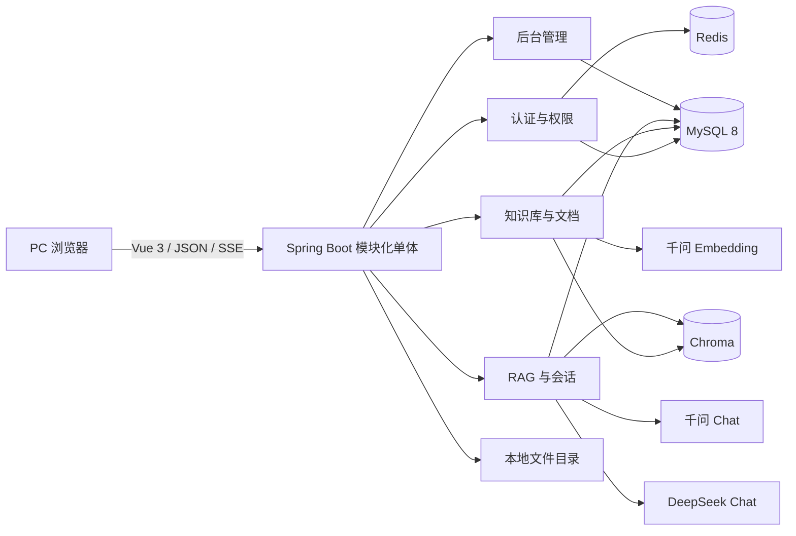
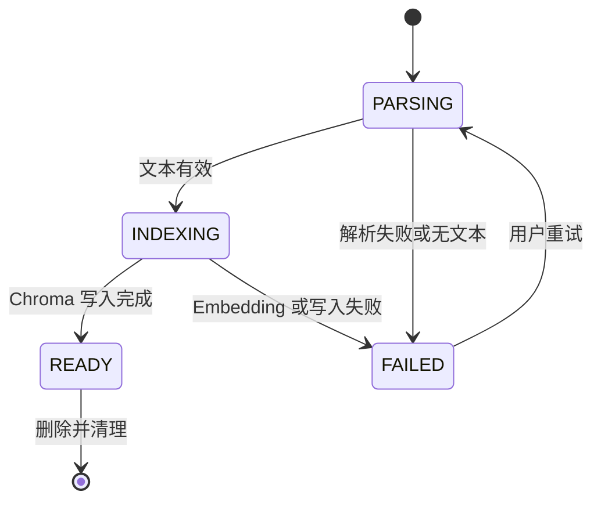
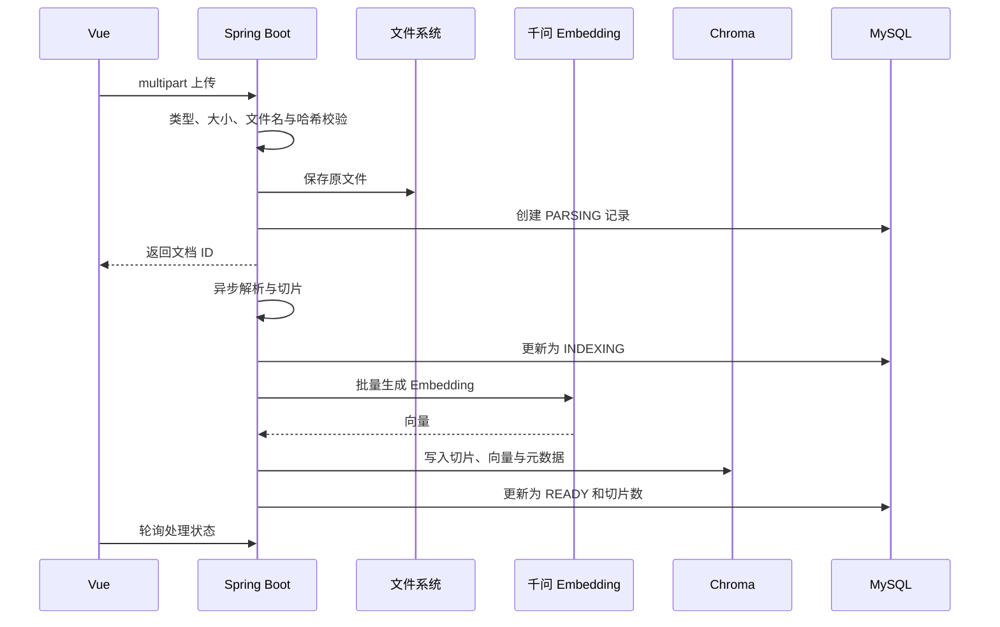

# BrainOS 项目总体设计

## 1. 设计原则

1. 采用模块化单体，在一个 Spring Boot 应用中保持清晰业务边界。
2. 完整呈现 RAG 主链路，但不引入微服务、消息队列、多租户等答辩非必要能力。
3. MySQL 保存业务事实，Chroma 保存向量切片，Redis 保存短期和高频状态，本地目录保存原文件。
4. 所有外部模型能力经 Spring AI 抽象接入，前端只调用自有后端。
5. UI 以简约、专业、可操作为优先，不制作营销页或复杂数据大屏。

## 2. 总体架构



前后端通过 `/api/v1` JSON API 通信；聊天使用 `text/event-stream`。MySQL、Redis 和 Chroma 由 Docker Compose 启动，前后端在开发阶段分别运行。

## 3. 技术栈基线

| 层次 | 技术 |
| --- | --- |
| Java | Java 21 LTS |
| 后端 | Spring Boot 3.x、Spring MVC、Spring Security、Spring Validation |
| 数据访问 | MyBatis-Plus、MySQL 8.x、Flyway |
| 缓存 | Redis 7.x、Spring Data Redis |
| AI | Spring AI 1.1.x、千问 Embedding、千问 Chat、DeepSeek Chat |
| 向量库 | Chroma 1.x、Spring AI Chroma Vector Store |
| 文档处理 | Apache Tika、Spring AI DocumentReader、TokenTextSplitter |
| 前端 | Vue 3.4+、Vite、Vue Router、Pinia、Element Plus |
| 图表 | ECharts，仅用于七日问答折线图 |
| 工程辅助 | Lombok、MapStruct、springdoc-openapi、Swagger UI、Mermaid |
| 测试 | JUnit 5、Spring Boot Test、Testcontainers、Vitest、Vue Test Utils、Playwright |
| 部署 | Docker Compose、本地文件存储、环境变量配置 |

实现计划必须锁定经过兼容性验证的补丁版本，并保持 Spring Boot 3.x 约束。

## 4. 后端模块边界

```text
com.brainos
├── auth          # 登录、刷新、退出、当前用户、JWT 与安全配置
├── dashboard     # 聚合统计与最近文档
├── knowledge     # 知识库生命周期
├── document      # 上传、解析、切片、索引、重试与清理
├── rag           # 检索、提示词、流式生成、引用与会话
├── admin         # 用户管理与操作日志查询
└── common        # 响应、异常、校验、分页、审计和基础配置
```

- Controller 只处理协议、校验和授权上下文。
- Application Service 编排用例和事务。
- Domain Service 承载可独立测试的规则。
- Mapper 只负责 MySQL 持久化。
- AI、Chroma、文件系统以端口接口隔离，测试可替换为内存实现或容器实现。

## 5. 核心数据模型

### 5.1 `sys_user`

`id`、`username`、`password_hash`、`display_name`、`role`、`status`、`last_login_at`、`created_at`、`updated_at`。

### 5.2 `knowledge_base`

`id`、`name`、`description`、`created_by`、`created_at`、`updated_at`。对 `name` 建立全局唯一索引。知识库是企业共享资源，全部启用用户可见并可维护；管理员权限只额外覆盖用户与日志模块。

### 5.3 `kb_document`

`id`、`knowledge_base_id`、`original_name`、`storage_path`、`mime_type`、`size_bytes`、`sha256`、`status`、`chunk_count`、`failure_reason`、`uploaded_by`、`created_at`、`updated_at`。对 `(knowledge_base_id, sha256)` 建立唯一索引。

状态机：



### 5.4 `chat_session`

`id`、`title`、`knowledge_base_id`、`chat_model`、`user_id`、`created_at`、`updated_at`。

### 5.5 `chat_message`

`id`、`session_id`、`role`、`content`、`citations_json`、`created_at`。引用 JSON 只保存回答实际采用的文档 ID、文件名、页码、片段和相似度。

### 5.6 `audit_log`

`id`、`user_id`、`action`、`target_type`、`target_id`、`result`、`summary`、`created_at`。

## 6. Chroma 设计

- 使用一个项目集合，通过 `knowledgeBaseId` 元数据过滤实现知识库隔离。
- 记录 ID 使用稳定的 `documentId:chunkIndex`，便于重试时覆盖和删除时定位。
- 切片正文与 Embedding 保存在 Chroma；MySQL 只保存文档级状态和 `chunk_count`。
- 元数据字段固定为 `knowledgeBaseId`、`documentId`、`fileName`、`pageNumber`、`chunkIndex`。
- 任何重试都先按 `documentId` 清理旧向量，再重新写入，防止半成品和重复记录。

## 7. 文档导入流程



后台任务使用受控的 Spring `TaskExecutor`，不引入消息队列。单次失败记录可读原因；解析或索引失败时清理当次产生的 Chroma 记录。

## 8. RAG 问答流程

1. 校验会话所有权、知识库存在且包含可用文档。
2. 使用千问 Embedding 生成问题向量。
3. 通过 `knowledgeBaseId` 过滤，从 Chroma 获取 Top 5 片段并应用相似度阈值。
4. 没有可靠片段时直接返回固定兜底答案，不调用聊天模型。
5. 将系统约束、引用编号、片段正文和用户问题组装为提示词。
6. 根据会话模型选择千问或 DeepSeek ChatModel。
7. 通过 SSE 输出 `start`、`delta`、`citations`、`done` 或 `error` 事件。
8. 只在完整结束后保存 AI 消息与实际引用；中途失败只保存用户问题和错误状态。

## 9. API 边界

| 资源 | 主要端点 |
| --- | --- |
| 认证 | `POST /api/v1/auth/login`、`POST /refresh`、`POST /logout`、`GET /me` |
| 工作台 | `GET /api/v1/dashboard/summary`、`GET /trends`、`GET /recent-documents` |
| 知识库 | `GET/POST /api/v1/knowledge-bases`、`GET/PUT/DELETE /{id}` |
| 文档 | `POST /api/v1/knowledge-bases/{id}/documents`、`GET /documents`、`POST /documents/{id}/retry`、`DELETE /documents/{id}` |
| 会话 | `GET/POST /api/v1/chat/sessions`、`GET/PUT/DELETE /sessions/{id}` |
| 问答 | `POST /api/v1/chat/sessions/{id}/messages/stream` |
| 用户 | `GET/POST /api/v1/admin/users`、`PUT /users/{id}`、`PATCH /users/{id}/status` |
| 日志 | `GET /api/v1/admin/audit-logs` |

所有非流式接口返回统一结构：`code`、`message`、`data`、`traceId`、`timestamp`。列表接口使用 `page`、`size`、`total`、`items`。

请求/响应 DTO 使用 MapStruct 与领域对象转换，Lombok 只用于消除无业务意义的样板代码。springdoc-openapi 从控制器与 DTO 生成 OpenAPI 文档，并在开发环境提供 Swagger UI；生产配置可关闭交互文档。

## 10. 安全设计

- Spring Security 无状态访问令牌验证；刷新令牌采用不可逆摘要存入 Redis，并设置 7 天 TTL。
- 密码使用 BCrypt；认证错误使用统一文案；停用用户不能登录或刷新。
- URL 与方法级权限双重保护管理员接口。
- 上传文件进行扩展名、MIME、大小、哈希和规范化路径校验，存储名使用服务端生成的 UUID。
- 模型密钥、JWT 密钥和数据库密码仅从环境变量读取，`.env` 不进入版本库。
- 日志对令牌、密码、Authorization 头和供应商密钥进行脱敏。
- 数据库变更由 Flyway 管理；MyBatis-Plus 使用参数化查询。

## 11. 错误与一致性

- 业务错误拥有稳定错误码，前端根据错误码展示可操作提示。
- 文件保存成功但数据库写入失败时删除文件；数据库记录成功但异步处理失败时保留失败记录供重试。
- 删除操作先标记业务删除意图，再清理 Chroma 和文件，最后删除业务记录；清理失败时保留失败日志并允许重试。
- SSE 断开时停止下游订阅；未完成回答不作为成功 AI 消息保存。
- 外部模型超时、限流和不可用分别映射为可重试错误，不暴露供应商响应体中的敏感信息。

## 12. 前端信息架构

统一应用壳由左侧导航、顶部标题/用户操作栏和主内容区组成。页面固定为：登录、工作台、知识库、文档管理、AI 问答、用户管理、操作日志。

- 普通用户不渲染用户管理和操作日志入口。
- 文档处理状态通过标签和文字同时表达，不只依赖颜色。
- AI 问答采用左侧会话栏和中间对话区，引用在回答下方展开，不增加固定第三栏。
- 所有表格具备加载、空、错误和分页状态。
- 设计细节以 `design-system/MASTER.md` 为唯一视觉基线。

## 13. 测试策略

1. 领域单元测试：权限规则、状态机、切片元数据、引用组装和兜底逻辑。
2. 后端切片测试：Controller、Security、Mapper 和 Service 分层验证。
3. 容器集成测试：MySQL、Redis、Chroma 的写入、过滤、清理与迁移。
4. 前端组件测试：登录、上传校验、状态表格、模型选择、SSE 状态机和引用展示。
5. 端到端测试：默认管理员登录到引用查看的完整主链路，以及普通用户越权失败路径。
6. 验收追踪：模块 `tasks.md` 必须逐项引用 `A-Rx-xx`。

## 14. 部署与演示

- `docker-compose.yml` 启动 MySQL、Redis、Chroma 并配置健康检查与持久卷。
- 后端启动前执行 Flyway；初始化脚本创建一个启用的管理员。
- README 提供环境变量表、启动顺序、演示文件要求、常见错误和清理命令。
- 答辩主流程固定为：登录 -> 新建知识库 -> 上传文本型文档 -> 等待可用 -> 提问 -> 展开引用 -> 查看工作台与日志。
- 移动端和窄屏布局不属于交付范围；桌面验收视口为 1024px 与 1440px。
